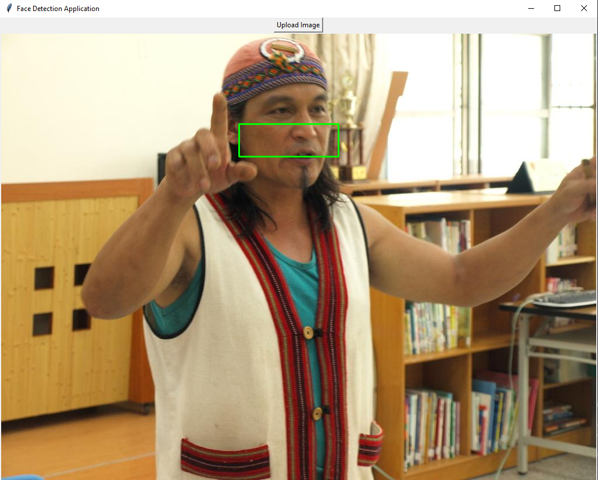

# Face Detection

Proyek ini mengimplementasikan deteksi wajah menggunakan Convolutional Neural Network (CNN) dengan Keras dan transfer learning menggunakan MobileNet. Aplikasi ini memungkinkan pengguna untuk mengunggah gambar dan mendeteksi wajah di dalamnya.

## Requirements

Pastikan Anda memiliki perangkat lunak berikut terinstal di sistem Anda:

- Python min ver3.11
- pip (Python package installer)

## Installation Steps

1. **Clone Repository**

   Clone repository ini ke lokal Anda menggunakan perintah berikut:

   ```bash
   git clone https://github.com/username/Face_Detection.git
   cd Face_Detection
   ```

2. **Install Dependencies**

   Install semua dependencies yang diperlukan menggunakan `pip`:

   ```bash
   pip install -r requirements.txt
   ```

## Project Structure

Berikut adalah struktur direktori dari proyek ini:
```
Face_Detection/
│
├── dataset/
│ ├── test/
│ └── train/
│ └── validation/
|
├── documentation/
│ ├── Face Detection Project.pdf
|
├── image/
|
├── model/
│ ├── development/
│ │ ├── MobileNet.ipynb
│ │ ├── Pre_trained_MobileNet.ipynb
│ │ ├── Testing.ipynb
│ │ └── CNN_Keras.ipynb
│ └── .gitattributes
│ └── keras.h5
│ └── tuned_keras.h5
|
├── src/
│ └── app.py
│ └── face_detection.py
|
├── Face Detection Project.pdf
├── requirements.txt
└── README.md
```

## Run Face Detection Program

1. **Jalankan Script Deteksi Wajah**

   Untuk menjalankan aplikasi deteksi wajah, gunakan perintah berikut:

   ```bash
   cd src
   python face_detection.py
   ```

   Aplikasi ini akan membuka jendela GUI yang memungkinkan Anda untuk upload gambar dan mendeteksi wajah di dalamnya. Silahkan upload gambar yang ingin di deteksi dan klik tombol "Detect" untuk melihat hasil deteksi wajah. Berikut adalah contoh deteksi wajah:

   

   Untuk menjalankan deteksi wajah melalui UI Web, gunakan perintah berikut:

   ```bash
   cd src
   streamlit run app.py
   ```
